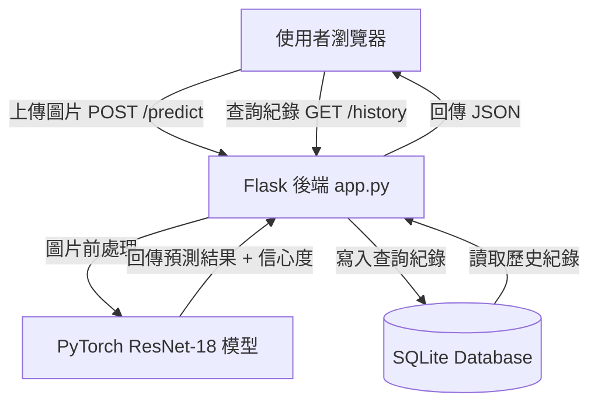
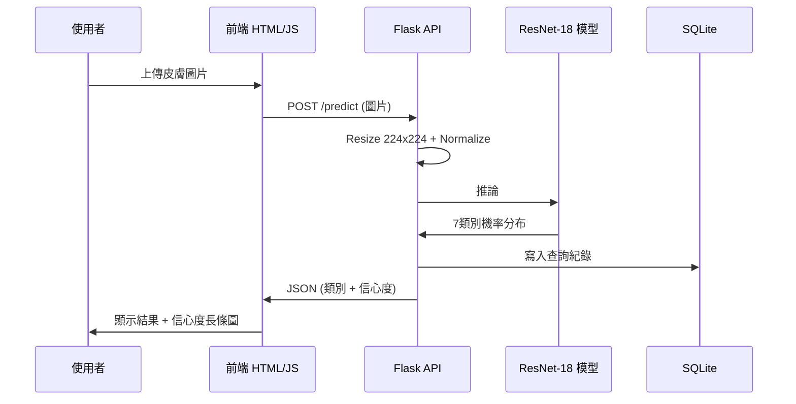

# 🩺 AI 皮膚病灶辨識 Web App

上傳皮膚圖片，AI 自動辨識 7 種常見病灶類型並顯示信心度。  
使用 ResNet-18 遷移學習訓練，準確率達 **84.1%**，整合 Flask 後端與 SQLite 資料庫，提供完整的 Web 使用介面。

🔗 **Live Demo**：https://skin-ai-webapp.onrender.com  
📂 **Dataset**：[HAM10000 - Kaggle](https://www.kaggle.com/datasets/kmader/skin-lesion-analysis-toward-melanoma-detection)

---

## 📸 截圖


---

## 🏗️ 系統架構



---

## 🔄 資料流



---

## ⚙️ 運行邏輯

### 1. 資料前處理

```
HAM10000 原始圖片 (10,015張)
        ↓ organize_data.py
讀取 HAM10000_metadata.csv，依 dx 欄位
將圖片複製到對應類別資料夾
        ↓ split_data.py
依比例切分（固定 random seed=42，確保可重現）
Train / Val / Test = 7 : 1.5 : 1.5
 7007  / 1499 / 1509 張
```

### 2. 模型訓練

```
ResNet-18（載入 ImageNet 預訓練權重）
        ↓
解凍所有層，替換最後 fc 層為 7 類輸出
        ↓
Data Augmentation（防止 overfitting）
RandomHorizontalFlip / RandomRotation(15) / ColorJitter
        ↓
處理類別不平衡（nv 是 df 的 58 倍）
使用 compute_class_weight 加權 CrossEntropyLoss
        ↓
差異化學習率
前面層 lr=1e-5（保留 ImageNet 特徵）
最後層 lr=1e-4（快速學習新分類）
        ↓
訓練 30 epochs，儲存最佳 Val Accuracy 模型
最佳 Val Accuracy = 84.1%
```

### 3. Web App 推論流程

```
使用者上傳圖片
        ↓
Flask 接收 POST /predict
        ↓
PIL 讀取圖片 → convert("RGB")
        ↓
Resize(224,224) → ToTensor → Normalize
        ↓
unsqueeze(0) 增加 batch 維度 [1,3,224,224]
        ↓
ResNet-18 模型推論（torch.no_grad）
        ↓
Softmax → 7 類別機率分布
        ↓
        ├── 寫入 SQLite（檔名、結果、信心度、時間）
        └── 回傳 JSON 給前端
                ↓
前端渲染辨識結果 + 信心度長條圖
GET /history 顯示歷史查詢紀錄
```

---

## 🛠️ 技術架構

| 層面 | 技術 |
|------|------|
| AI 模型 | PyTorch / ResNet-18 Transfer Learning |
| 後端 | Python Flask |
| 前端 | HTML / CSS / JavaScript |
| 資料庫 | SQLite |
| 部署 | Render |
| 版本控制 | Git / GitHub |

---

## 💡 技術選型原因

### 前端：原生 HTML / CSS / JavaScript
- 不依賴任何框架（React、Vue），減少部署複雜度
- Flask 可直接用 `render_template` 渲染，不需要前後端分離設定
- 圖片上傳使用 `FormData` + `fetch` 原生 API，輕量且相容性高
- 信心度長條圖用純 CSS 動態渲染，不需引入圖表套件

### 後端：Python Flask
- 輕量級框架，適合單一功能的 AI 推論服務
- 與 PyTorch 同為 Python 生態，模型可直接在同一進程載入，不需跨語言通訊
- `@app.route` 快速定義 REST API，開發效率高
- 相較於 Django 更簡潔，不需要 ORM、Admin 等多餘功能

### AI 框架：PyTorch
- 業界與學術界主流框架，動態計算圖便於 debug
- `torchvision.models` 內建 ResNet-18 預訓練權重，可直接載入
- `torch.no_grad()` 推論時關閉梯度計算，降低記憶體使用

### 模型：ResNet-18
- 輕量化 CNN 架構，在 Render 免費方案（512MB RAM）可正常運行
- ImageNet 預訓練權重已學會基礎視覺特徵（邊緣、紋理、顏色），遷移到皮膚圖片效果好
- 相較於 ResNet-50/101，推論速度更快，適合 Web 即時應用

### 資料庫：SQLite
- Python 內建，不需額外安裝資料庫服務
- 本專案查詢量小（單人使用），SQLite 效能完全足夠
- 部署到 Render 不需設定外部資料庫連線，降低部署複雜度
- 若未來需要擴展，可輕鬆遷移至 PostgreSQL（只需修改連線字串）

### 部署：Render
- 支援直接從 GitHub repo 自動部署，推送即更新
- 免費方案提供公開 HTTPS 網址，可直接用於 Demo
- 支援 Python / gunicorn，與 Flask 完全相容

---

## 🗂️ 專案結構

```
skin-ai-webapp/
├── app.py                  # Flask 主程式，定義 API 端點
├── organize_data.py        # 讀取 CSV，將圖片依類別整理至資料夾
├── split_data.py           # 切分 train / val / test 資料集
├── train.py                # 模型訓練腳本（ResNet-18 遷移學習）
├── model/
│   ├── best_model.pth      # 訓練完成的模型權重
│   ├── history.csv         # 每個 epoch 的 loss / accuracy 紀錄
│   └── training_curve.png  # 訓練曲線圖
├── templates/
│   └── index.html          # 前端介面（上傳、結果、歷史紀錄）
├── data/                   # 資料集（不上傳 GitHub）
├── requirements.txt        # Python 套件清單
├── render.yaml             # Render 部署設定
└── README.md
```

---

## 📊 模型訓練結果

| 指標 | 數值 |
|------|------|
| 訓練集準確率 | 93.2% |
| 驗證集準確率 | **84.1%** |
| 訓練 Epochs | 30 |
| 模型架構 | ResNet-18 |
| 資料增強 | RandomFlip / RandomRotation / ColorJitter |
| 類別不平衡處理 | Class Weight |


---


## 🏷️ 辨識類別

| 縮寫 | 中文名稱 | 訓練集數量 |
|------|---------|-----------|
| nv | 黑色素細胞痣 | 4,693 |
| mel | 黑色素瘤 | 779 |
| bkl | 良性角化病 | 769 |
| bcc | 基底細胞癌 | 359 |
| akiec | 光化性角化病 | 228 |
| vasc | 血管病變 | 99 |
| df | 皮膚纖維瘤 | 80 |


---

## 🚀 本機安裝與執行

```bash
# 1. Clone 專案
git clone https://github.com/IFINNOT/skin-ai-webapp.git
cd skin-ai-webapp

# 2. 建立虛擬環境
python -m venv .venv
.venv\Scripts\activate  # Windows
source .venv/bin/activate  # Mac/Linux

# 3. 安裝套件
pip install -r requirements.txt

# 4. 啟動伺服器
python app.py
```

瀏覽器開啟 `http://localhost:5000`

> ⚠️ 注意：需自行下載 HAM10000 資料集並執行 `organize_data.py` → `split_data.py` → `train.py` 才能取得模型權重

---

## 👤 作者

張詠綸 — 電機工程學系  
[GitHub](https://github.com/IFINNOT)
